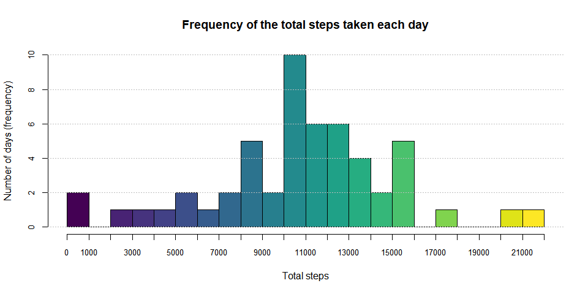
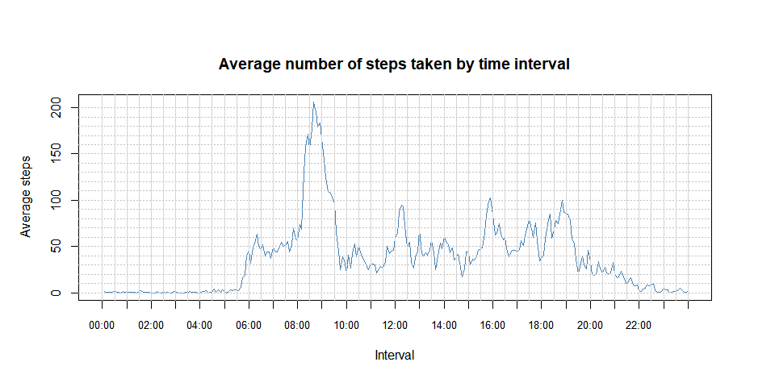
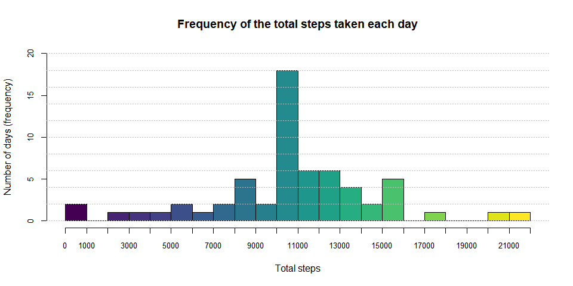
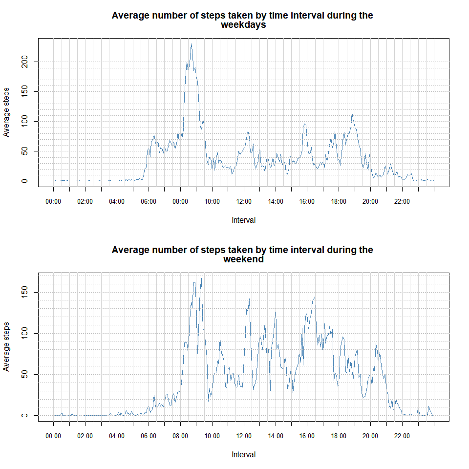

## General setup

```r
Sys.setlocale("LC_TIME", "C") 
```

```
## [1] "C"
```

```r
knitr::opts_chunk$set(
	eval = TRUE,
	echo = TRUE,
	include = TRUE, 
	cache = TRUE,
	results = 'markup',
	fig.height=5, fig.width=10
) 

options(scipen = 1, digits = 6)
```


```r
if(!require(pander)){
        install.packages("pander")
        library(pander)
}

if(!require(viridis)){
        install.packages("viridis")
        library(viridis)
}
```


## Loading and preprocessing the data

```r
if (!file.exists("./activity.csv")) {
        unzip(zipfile = "./activity.zip")        
}
activity <- read.csv("./activity.csv")
```


```r
pander(head(activity))
```


-------------------------------
 steps      date      interval 
------- ------------ ----------
  NA     2012-10-01      0     

  NA     2012-10-01      5     

  NA     2012-10-01      10    

  NA     2012-10-01      15    

  NA     2012-10-01      20    

  NA     2012-10-01      25    
-------------------------------

```r
activity$interval <- sprintf("%04d", activity$interval)
activity$interval <- format(strptime(activity$interval, format="%H%M"), format = "%H:%M")
pander(head(activity))
```


-------------------------------
 steps      date      interval 
------- ------------ ----------
  NA     2012-10-01    00:00   

  NA     2012-10-01    00:05   

  NA     2012-10-01    00:10   

  NA     2012-10-01    00:15   

  NA     2012-10-01    00:20   

  NA     2012-10-01    00:25   
-------------------------------

```r
activity.cc <- activity[complete.cases(activity),]
activity.cc$date <- droplevels(activity.cc$date)
```


## What is mean total number of steps taken per day?

### Histogram of the total number of steps taken each day

```r
total.steps.day.cc <- aggregate(activity.cc$steps, list(activity.cc$date), sum)
names(total.steps.day.cc) <- c("Day", "Steps")
```


```r
hist(total.steps.day.cc$Steps,
     breaks = seq(0, 22000, 1000),
     main = "Frequency of the total steps taken each day",
     xlab = "Total steps", xlim = c(0,22000),  xaxp=c(0,22000,22),
     ylab = "Number of days (frequency)", ylim = c(0,10),
     cex.axis = 0.8, col = viridis(22))
abline(h=seq(0,10,2), col="gray", lty="dotted" )
```

<!-- -->

### Mean and median total number of steps taken per day

The **mean** total numbers of steps taken per day is 10766 
and the **median** is 10765.

## What is the average daily activity pattern?
### Time series plot of the average number of steps taken

```r
mean.steps.interval.cc <- aggregate(activity.cc$steps, list(activity.cc$interval), mean)
names(mean.steps.interval.cc) <- c("Interval", "Steps")
par(oma = c(.5,1,2,2))
plot(mean.steps.interval.cc$Steps, 
     type = "l", lwd = 1.8, col = "Steelblue",
     main = "Average number of steps taken by time interval",
     xlab = "Interval", xlim = c(0,288), xaxt = 'n',
     ylab = "Average steps")
axis(side = 1, at=seq(0,288,12), labels = mean.steps.interval.cc$Interval[seq(1,289,12)], cex.axis = .8)
abline(h=seq(0,200,10), col = "gray", lty ="dotted")
abline(v=seq(0,288,6), col = "lightgray")
```

<!-- -->

### The 5-minute interval that, on average, contains the maximum number of steps

```r
max.steps <- mean.steps.interval.cc[which.max(mean.steps.interval.cc$Steps),]
```
The interval that on average contains the maximum number of steps is the one that starts at 
08:35.


## Imputing missing values
### Calculate and report the numver of missing values in the dataset

```r
na.activity <- is.na(activity)
nas <- sum(na.activity == TRUE)
```
There are 2304 NA's in the dataset

### Filling in all of the missing values 
**Create a new data set with the missing data filled in.**  
The missing values are replaced with the mean value corresponding to each interval.

```r
activity.f <- activity
for (i in 1:nrow(activity.f)){
        if (is.na(activity.f$steps[i]) == TRUE){
                activity.f$steps[i] <- mean.steps.interval.cc$Steps[match(activity.f$interval[i], 
                                                                mean.steps.interval.cc$Interval)]
        }
}
```

## Mean total number of steps taken per day
### Histogran of the total number of steps taken each day

```r
total.steps.day.f <- aggregate(activity.f$steps, list(activity.f$date), sum)
names(total.steps.day.f) <- c("Day", "Steps")
```


```r
hist(total.steps.day.f$Steps,
     breaks = seq(0, 22000, 1000),
     main = "Frequency of the total steps taken each day",
     xlab = "Total steps", xlim = c(0,22000),  xaxp=c(0,22000,22),
     ylab = "Number of days (frequency)", ylim = c(0,20),
     cex.axis = 0.8, col = viridis(22))
abline(h=seq(0,20,2), col="gray", lty="dotted" )
```

<!-- -->

### Mean and median total number of steps taken per day
The **mean** total numbers of steps taken per day is 10766 
and the **median** is 10766.

### Questions
**Do these values differ from the estimates from the first part of the assignament?**  
No, there was no change since the imputed values are the mean values for each interval.  

**What is the impact of imputing missing data on the estimates of the total daily number of steps?**  
Due to the imputation method, there wasn't a significant impact.

## Are there differences in activity patterns between weekdays and weekends?
### Create new factor variable indicaten weather a given date is a weekday or weekend day

```r
activity.f$date <- as.Date(activity$date)
for (i in 1:nrow(activity.f)){
        if (weekdays(as.Date(activity.f$date)[i]) %in% c("Saturday","Sunday"))         {
                activity.f$WDay[i] <- "weekend"
        } else {
                activity.f$WDay[i] <- "weekdays"
        }
}
activity.f$WDay <- as.factor(activity.f$WDay)
```


### Panel plot containing a time series plot of the 5-minute interval and the average 
number of steps taken averaged across all weekday or weekend days.

```r
splited.activity <- split(activity.f, activity.f$WDay)

par(mfrow = c(2,1))
for (i in 1:2) {
        mean.steps.interval.f <- aggregate(splited.activity[[i]]$steps, list(splited.activity[[i]]$interval), mean)
        names(mean.steps.interval.f) <- c("Interval", "Steps")
        plot(mean.steps.interval.f$Steps, 
                type = "l", lwd = 1.8, col = "Steelblue",
                main = paste(c("Average number of steps taken by time interval during the ", 
                               names(splited.activity)[i])),#,names(splited.activity)[i]),
                xlab = "Interval", xlim = c(0,288), xaxt = 'n',
                ylab = "Average steps")
        axis(side = 1, at=seq(0,288,12), labels = mean.steps.interval.cc$Interval[seq(1,289,12)], cex.axis = .8)
        abline(h=seq(0,200,10), col = "gray", lty ="dotted")
        abline(v=seq(0,288,6), col = "lightgray")
}
```

<!-- -->

During the weekdays the activity was more concentrated towards the morning and during the weekend
it was distributed through all the day. Also, activity starts increasing later on weekends,
so maybe  it just shows that the subject wakes up later (and also goes to bed later).

  

